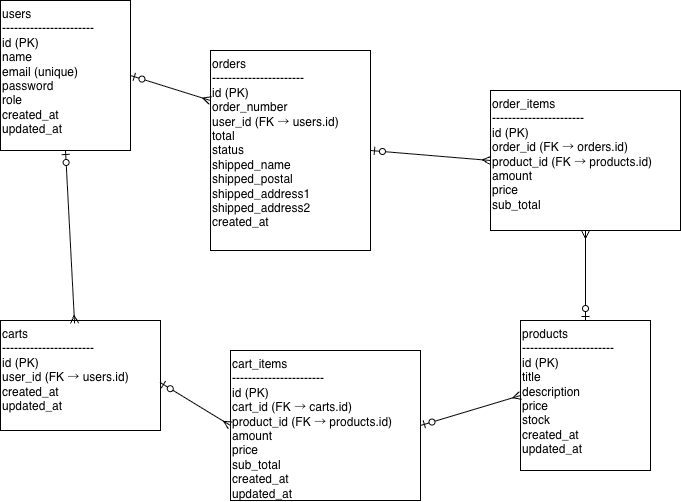

# ECApp

## 概要
Spring Boot + Gradle で作成したECサイトのバックエンドAPI。

## 技術スタック
- Java 21
- Spring Boot
- Gradle
- MySQL
- JPA / Hibernate
- GitHub

## 機能一覧
- ユーザー管理
- 商品管理
- 注文管理

## API設計
### ユーザーAPI
| Method | URL | 説明 |
|------|-----|-----|
| GET | /api/users | ユーザー一覧取得 |
| POST | /api/users | ユーザー登録 |

### 注文API
| Method | URL | 説明 |
|------|-----|-----|

## DB設計
### users テーブル
| カラム名 | 型 | 説明 |
|-------|----|----|
| id | BIGINT | PK |
| email | VARCHAR | メール |

### orders テーブル
| カラム名 | 型 | 説明 |
|-------|----|----|

## ER図


## 起動方法
```bash
./gradlew bootRun
